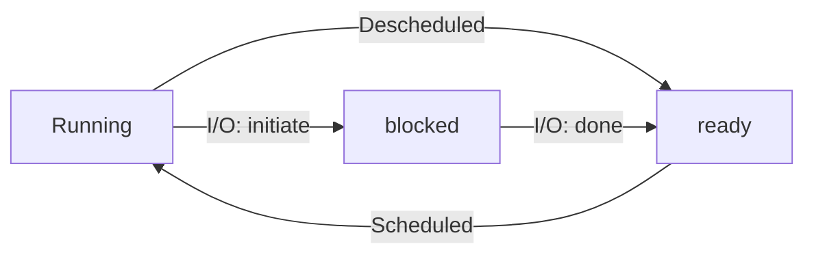

## Operating Systems : Three Easy Pieces

### Part 1 Virtualization

#### The Abstraction: The Process

Definition of **Process**: a running program.

**Virtualizing** the CPU : low-level machinery mechanisms + OS scheduling policy

**Machine State**: what a program can read or update when it's running? Memory + Registers + Persistent storage devices.

**Process API**: Create, Destroy, Wait, Miscellaneous Control, Status

**Process States**:

- Running: program is executing instructions.
- Ready: a process is ready to run but for some reason the OS has chosen not to.
- Blocked: a process has performed some kind of operation that makes it not ready to run until some other event takes place.

**Process List**: keep track of all the running programs in the system together with some additional information to track which process is currently running. ( See xv6-pro-structure.h )

